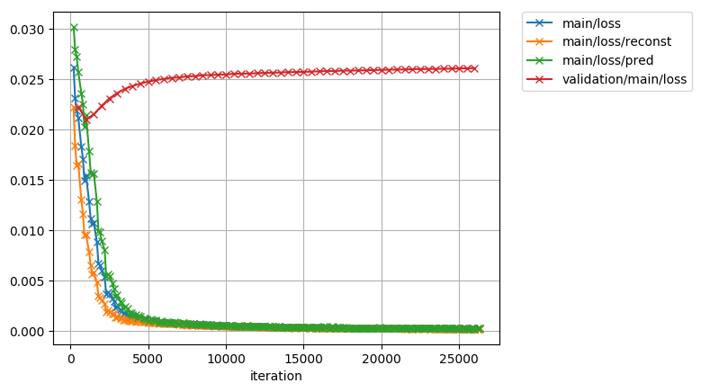
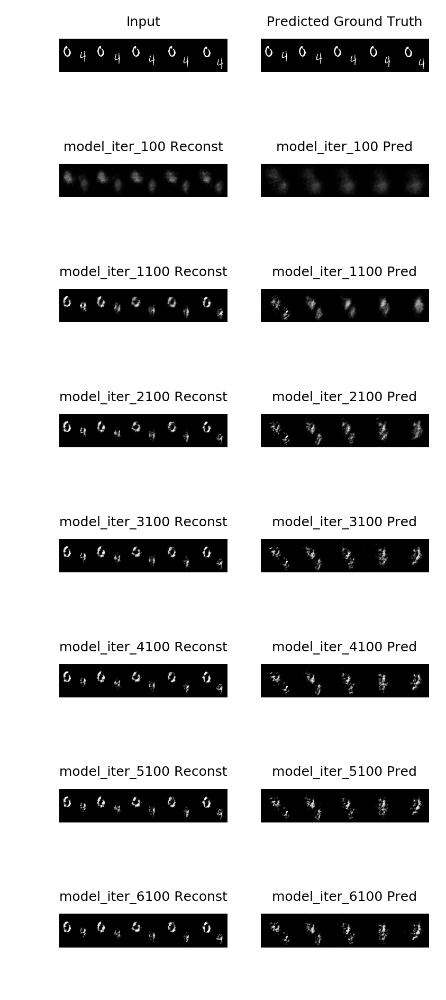

# Unsupervised Learning of Video Representations using LSTMs

## Train

``` bash
# single gpu
python ./train.py --gpu 0
# multiple (4) gpus
mpirun -np 4 python train.py --multi-gpu
```

After running this script, trained data and log files are generated at `results` directory.



## Visualize

``` bash
python ./predict.py predict --gpu 0 results/model_iter_100000
# or
python ./predict.py summary --gpu 0 results
```

This script generates images where the outputs generated from trained network are visualized into `predict` directory.


