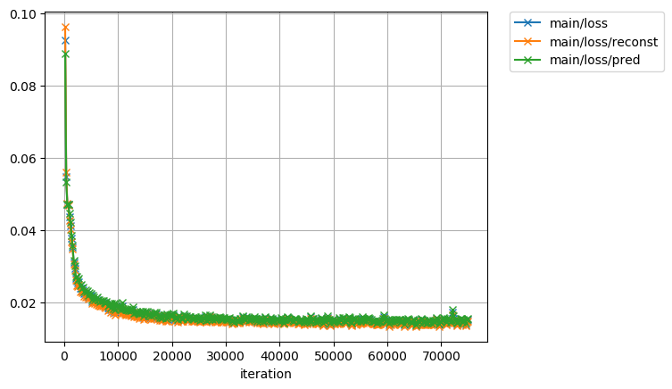
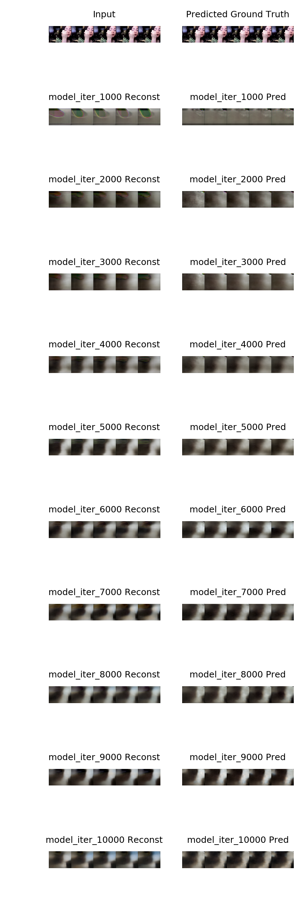
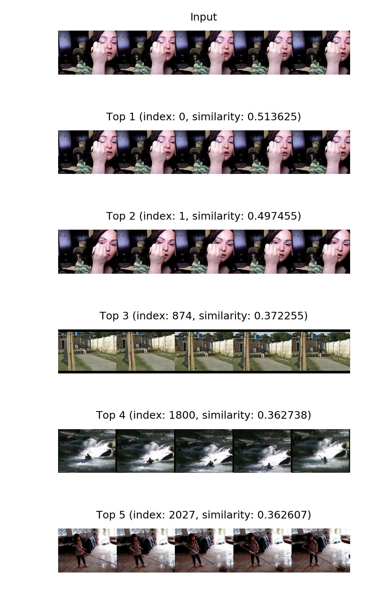

# Deep Episodic Memory: Encoding, Recalling, and Predicting Episodic Experiences for Robot Action Execution

## Train

``` bash
python ./train.py --gpu 0
# or
mpirun -np 3 python train.py --multi-gpu
```

After running this script, trained data and log files are generated at `results` directory.



## Visualize

To visualize the reconstructed / predicted images as the output of composite model for specific weights, run:

``` bash
python ./predict.py predict --gpu 0 results/model_iter_1000
```

This script generates images where the outputs generated from trained network are visualized into `predict` directory.

## Summary

To visualize the reconstructed / predicted images for multiple models in a list, run:

``` bash
python ./predict.py summary --gpu 0 results/
```



## Extract

To extract latent vector values for all dataset using specific weights, run:

``` bash
python ./predict.py extract --gpu 0 results_mse_gd/model_iter_16000
```

The extracted features are saved as `predicts/features.npz` by default.

## Detect

To visualize the top N similar images to the input image, run:

``` bash
python ./predict.py detect --gpu 0 results_mse_gd/model_iter_16000 predicts/features.npz 0 5
```


